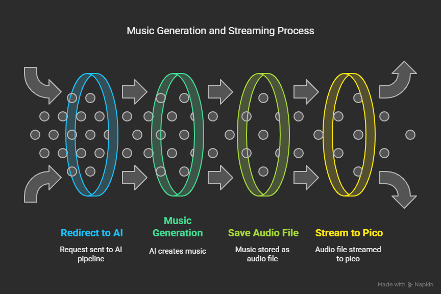

# Smart Winter Village

The **Smart Winter Village** is an IoT-powered system designed to enhance the safety, comfort, and experience of a remote cabin environment. This project integrates multiple components, including backend services, embedded systems, and AI-powered features, to provide a seamless and intelligent solution for managing reservations, monitoring environmental conditions, and creating a cozy ambiance.

## Project Overview

The project is divided into the following key parts:

1. **[Backend System](https://github.com/Abhishekadhikari725/smartwinterBackend/blob/main/README.md)**: A Node.js-based backend that powers the system, providing RESTful APIs, MQTT-based controls, and integration with external APIs for weather and aurora forecasts.

2. **[Embedded Controller](https://github.com/Iaraslav/smart-winter-village-embedded/blob/main/README.md)**: A MicroPython-based firmware running on Raspberry Pi Pico, responsible for controlling IoT devices like LED lights, music playback, and temperature sensors.

3. **[AI Music Generation](https://github.com/Logisx/music_gen_iot)**: An AI-powered system for generating mood-based music using the MusicGen model from Audiocraft.

4. **[Frontend Application](https://github.com/adduserwyw/smart-winter-village-fe/tree/main)**: A React Native/Expo-based application optimized for TV platforms, allowing users to interact with the system.

> ⚠️ **Warning:** The descriptions provided here are summaries. To access the full source code and implementation details, please follow the respective repository links below:
> 1. [Backend System](https://github.com/Abhishekadhikari725/smartwinterBackend/blob/main/README.md)
> 2. [Embedded Controller](https://github.com/Iaraslav/smart-winter-village-embedded/blob/main/README.md)
> 3. [AI Music Generation](https://github.com/Logisx/music_gen_iot)
> 4. [Frontend Application](https://github.com/adduserwyw/smart-winter-village-fe/tree/main)

---

# Table of Contents

- [Smart Winter Village](#smart-winter-village)
  - [Project Overview](#project-overview)
- [Table of Contents](#table-of-contents)
- [Smart Winter Village — Backend](#smart-winter-village--backend)
  - [Core Features](#core-features)
  - [Project Structure](#project-structure)
  - [Environment Setup](#environment-setup)
  - [API Reference](#api-reference)
    - [Weather](#weather)
    - [Aurora](#aurora)
    - [Ice Detection](#ice-detection)
    - [Mood Control](#mood-control)
    - [Guest Services](#guest-services)
  - [MQTT Topics](#mqtt-topics)
  - [Deployment with Systemd](#deployment-with-systemd)
  - [Team \& Contributions](#team--contributions)
- [Smart Winter Village FE](#smart-winter-village-fe)
  - [Features](#features)
  - [Prerequisites](#prerequisites)
  - [Getting Started](#getting-started)
  - [Project Structure](#project-structure-1)
  - [Available Scripts](#available-scripts)
  - [Testing](#testing)
  - [License](#license)
  - [Contact](#contact)
- [Smart Winter Village - AI Music Generation](#smart-winter-village---ai-music-generation)
    - [Showcase Workflow](#showcase-workflow)
    - [Implementation Design](#implementation-design)
    - [Code Key components:](#code-key-components)
    - [MusicGen Model](#musicgen-model)
  - [Dependencies](#dependencies)
    - [Example Curl Command](#example-curl-command)
- [Smart Winter Village – Embedded Controller](#smart-winter-village--embedded-controller)
    - [Features](#features-1)
    - [Folder Structure](#folder-structure)
    - [Setup Instructions](#setup-instructions)
      - [1. Flash MicroPython](#1-flash-micropython)
      - [2. Clone the repository](#2-clone-the-repository)
      - [3. Create and configure config.py](#3-create-and-configure-configpy)
      - [4. Upload files to Pico](#4-upload-files-to-pico)
    - [MQTT Topics](#mqtt-topics-1)
    - [Wiring](#wiring)
      - [MLX90614 (Infrared Temperature Sensor)](#mlx90614-infrared-temperature-sensor)
      - [Speaker (with built-in amplifier or headphones)](#speaker-with-built-in-amplifier-or-headphones)

---

# Smart Winter Village — Backend

This backend system powers the Smart Winter Village project, enabling real-time communication between IoT devices, guests, and external APIs such as weather and aurora forecasts. Built with **Node.js**, it serves RESTful APIs and MQTT-based controls for a real-time smart environment experience.

---

##  Core Features

- **Weather Forecasting** – Current, hourly, and daily via OpenWeather
- **Aurora Prediction** – Scrapes and calls api from FMI for aurora visibility data
- **Ice Path Detection** – Uses InfluxDB sensor data to detect icy conditions
- **Mood-Based Cabin Control** – Lighting and music control via MQTT
- **Guest Service Requests** – RESTful form submission with tracking
- **Systemd Deployment** – Stable VM service managed by `systemctl`

---

## Project Structure

```
Backend/
├── controllers/           # All route logic and processing
│   ├── weatherController.mjs
│   ├── auroraController.mjs
│   ├── temperatureController.mjs
│   ├── vibeController.mjs
│   └── guestServiceController.mjs
├── routes/                # Route modules
│   └── *.mjs
├── services/              # External APIs or scrapers
├── utils/                 # Utility helpers
├── .env                   # Environment configuration
├── app.mjs                # Express app setup
└── server.mjs             # Entry point for systemd
```

---

##  Environment Setup

Create a `.env` file in the root:

```env
OPENWEATHER_API_KEY=your_openweather_api_key
DB_INFLUX_TOKEN=your_influxdb_token
```

---

## API Reference

### Weather

- `GET /api/weather/current` – Current weather + daily summary
- `GET /api/weather/hourly` – Hourly forecast
- `GET /api/weather/daily` – 3-day forecast

### Aurora

- `GET /api/aurora/forecast` – Returns aurora prediction

### Ice Detection

- `GET /api/temperature/ice-status` – Detects if ice is present on path

### Mood Control

- `POST /api/vibe/update`

```json
{ "mood": "calm" }
```

### Guest Services

- `POST /api/guest/service`

```json
{
  "title": "Extra towels",
  "description": "Request for additional towels"
}
```

- `GET /api/guest/service` – Returns all submitted guest requests

---

## MQTT Topics

| Topic                  | Direction | Format                              |
|------------------------|-----------|--------------------------------------|
| `cabin/led`            | Publish   | `{ "r": 255, "g": 255, "b": 0 }`     |
| `cabin/sound`          | Publish   | `{ "track": 3 }`                     |

---

## Deployment with Systemd

**Systemd Unit File:**

```ini
[Unit]
Description=Backend Service for 24/7
After=network.target

[Service]
ExecStart=/home/youruser/.nvm/versions/node/vXX.X.X/bin/node /path/to/server.mjs
Restart=on-failure
User=youruser
Environment=NODE_ENV=production

[Install]
WantedBy=multi-user.target
```

**Commands:**

```bash
sudo systemctl daemon-reload
sudo systemctl enable backend.service
sudo systemctl start backend.service
sudo journalctl -u backend.service -f
```

---

##  Team & Contributions

- **Backend:** Abhishek Adhikari
- **Collaborators:** Frontend, AI, and Embedded teams
- **Project:** Smart Winter Village Hackathon 2025

---

# Smart Winter Village FE

This is a React Native/Expo application designed primarily for TV platforms. It allows users to interact with features like mood-based music generation and potentially weather information, connecting to a backend API for dynamic content.

- [Features](#features)
- [Prerequisites](#prerequisites)
- [Getting Started](#getting-started)
- [Project Structure](#project-structure)
- [Available Scripts](#available-scripts)
- [Testing](#testing)
- [License](#license)
- [Contact](#contact)

## Features

-   **Weather Display:** Fetches and displays current weather information. 
-   **Mood-Based Music Generation:** Select a vibe (Fun, Energetic, Romantic, Calm) to generate AI-powered music via a backend API.  
-   **Frozen Path Monitoring:** Displays real-time path temperature and ice warnings from an API .
-   **Aurora Forecast:** Shows Aurora Borealis forecast details including KP index, visibility, and viewing tips.
-   **Guest Service Requests:** Allows users to request services (Room Service, Housekeeping, Concierge, Maintenance), view existing requests, and submit new ones via an API.
-   **Property Information:** Presents a detailed list of property amenities grouped by category in an accordion interface.
-   **TV Optimized UI:** Built with React Native and Expo, suitable for TV displays.
-   **Audio Visualization:** Includes a simple visualization component when music is playing.
-   **API Integration:** Connects to a backend service for data.


## Prerequisites

-   [Node.js](https://nodejs.org/) (LTS recommended)
-   [Yarn](https://yarnpkg.com/) 
-   [Expo CLI](https://docs.expo.dev/get-started/installation/) (`npm install -g expo-cli` or `yarn global add expo-cli`)
-   A compatible TV device/emulator or web browser.


## Getting Started

To set up the project locally, follow these steps:

- **Clone the Repository:**  
  ```
    git clone https://github.com/adduserwyw/smart-winter-village-fe.git
  ```

- **Install Dependencies:**  
  Use yarn (preferred) or npm to install the required packages.  
  ```
    yarn install
  ```  
  or  
  ```
    npm install
  ```
- **Configure API Endpoint:**

  Change the API address in `config.js` to your backend api address.  
  ```
  const ENV = {
        development: {
                apiUrl: 'api_address',
        },
        production: {
                apiUrl: 'api_address',
        }
    };
  ```

- **Run Prebuild Script:**  
  Before starting the application, run the prebuild script to ensure everything is set up correctly.  
  ```
    yarn prebuild
  ```

- **Run the Application:**  
  Launch the development server using the following command:  
  ```
    yarn android
  ```
  This command starts the Metro bundler, letting you run the app on an emulator or a connected device.

## Project Structure

The repository is structured as follows:

| Folder/File           | Description                                  |
| --------------------- |----------------------------------------------|
| `__tests__/`         | Unit tests and test configuration files      |
| `assets/`             | Static assets (images, icons, etc.)          |
| `public/`             | Publicly available resources                 |
| `src/`                | Main source code for the application         |
| `App.tsx`             | Primary entry point of the application       |
| `package.json`        | Project metadata and dependency settings     |
| `babel.config.js`     | Babel configuration for transpiling code     |
| `metro.config.js`     | Metro bundler configuration for React Native |
| `jest.config.js`      | Jest configuration for running tests         |
| `tsconfig.json`       | TypeScript compiler configuration            |

## Available Scripts

Here are some key scripts for working with the project:

| Script          | Description                                           |
|-----------------|-------------------------------------------------------|
| `yarn test`     | Runs the Jest test suite                              |
| `yarn prebuild` | Builds the application for development and production |
| `yarn android`  | Starts the development server and Metro bundler       |

## Testing

The project is set up for testing with Jest. To run the tests, execute:

```
yarn test
```

Test files are located in the `__tests__/` directory and follow the configuration outlined in `jest.config.js`.

## License

This project does not currently include a license file. Please add one to clarify usage and distribution rights.

## Contact

For any questions or further information, please open an issue on this repository.


# Smart Winter Village - AI Music Generation

The AI-related code is located in the `Machine Learning` folder.

This section is divided into two parts: 
1. **Showcase Workflow** - A simplified version of the implementation used for demonstration purposes.
2. **Planned Implementation Design** - A detailed plan for the full implementation.



---

### Showcase Workflow

Due to server memory limitations, the music generation model cannot be stored on the server. For the showcase, music samples were pre-generated and installed on a Raspberry Pico. 

The workflow is as follows:
1. The frontend sends a request in JSON format (specified below).
2. The backend processes the request and forwards the mood setting to the Raspberry Pico.
3. The Pico activates the corresponding music track and light settings.

---

### Implementation Design

The current model is not optimized for real-time music generation. To address this, the following design is proposed:
1. **Background Generation**: Music generation will be performed in the background, and the results will be cached in a dedicated database.
2. **Request Handling**: Upon receiving a request from the frontend, the system will:
   - Search the cache for the relevant audio.
   - Stream the audio to the Raspberry Pico.

---

### Code Key components:
- **`music_generator.py`**: Handles the music generation model. The `generate_music` function in the `MusicGenerator` class is responsible for setting parameters, running the generation process, and saving the output file.
- **`server.py`**: Simulates a simple server with an API endpoint for testing the system independently of the main application server. Example usage is provided below.

Generated audio files are saved in the `output` folder.


---

### MusicGen Model

This project relies on the **MusicGen model** from [Audiocraft](https://github.com/facebookresearch/audiocraft), an open-source library developed by Meta. MusicGen is a state-of-the-art model for music generation, capable of producing high-quality audio based on input parameters such as mood, duration, and temperature. For more details, visit the [Audiocraft repository](https://github.com/facebookresearch/audiocraft).

---

## Dependencies

Refer to `AI_INSTALLATION.md` for detailed dependency installation instructions.

---

### Example Curl Command

Use the following command to test the system:

```bash
curl -X POST "http://localhost:8000/generate-music" \
-H "Content-Type: application/json" \
-d '{
  "mood": "fun",
  "activity": "",
  "duration": 10.0,
  "temperature": 1.2,
  "top_k": 100,
  "top_p": 0.9,
  "cfg_coef": 2.0
}'
```

**Note:** Additional parameters like `duration`, `temperature`, `top_k`, `top_p`, and `cfg_coef` are optional and will use default values if not specified. Reference [Audiocraft](https://github.com/facebookresearch/audiocraft) repository for more information.

Refer to `AI_TESTING.md` for detailed testing instructions.

# Smart Winter Village – Embedded Controller
This is the **embedded firmware** for the Smart Winter Village project, running on a Raspberry Pi Pico with MicroPython.  
It handles MQTT communication with the server, controls decorative lighting and music playback, and monitors road temperature using an infrared sensor.

---
### Features
- 🎵 **Music Playback**  
  Plays short WAV samples in response to MQTT commands (future: AI-generated music streamed live).

- 🌈 **LED Light Control**  
  Remote control of RGB LED colors (NeoPixels) with supported separate LEDs.

- 🌡️ **Road Temperature Monitoring**  
  Uses an MLX90614 infrared sensor to measure and report surface temperature.

- 📡 **MQTT Communication**  
  Subscribes to command topics (sound/light) and publishes temperature data. Integrates with InfluxDB via Telegraf.

### Folder Structure
```bash
smart-winter-village-embedded/
├── umqtt/
│   └── simple.py
├── config.py
├── config.py.example
├── main.py
├── mlx90614.py
├── mqtt_utils.py
├── network_utils.py
├── sensor_utils.py
├── track1.wav
├── track2.wav
├── track3.wav
├── track4.wav
```
### Setup Instructions

#### 1. Flash MicroPython
Flash the latest MicroPython firmware to your Raspberry Pi Pico using [Thonny](https://thonny.org/) or another flashing tool.

#### 2. Clone the repository
```bash
git clone https://github.com/Iaraslav/smart-winter-village-embedded.git
cd smart-winter-village-embedded
```
#### 3. Create and configure config.py

```bash
cp config.py.example config.py
```
```py
#config.py
ssid = "YourWiFiSSID"
password = "YourWiFiPassword"

MQTT_BROKER = "YourBrokerIP"
MQTT_PORT = 1883 # Your Broker Port (1883 - Default)

MQTT_LED_TOPIC = "cabin/led"
MQTT_SOUND_TOPIC = "cabin/sound"
MQTT_TOPIC_TEMP = "sensors/temperature"
```

#### 4. Upload files to Pico

### MQTT Topics

| Topic              | Direction | Example                 | Description                                   |
|--------------------|-----------|-------------------------|-----------------------------------------------|
| cabin/led          | IN        | {"r":255,"g":0,"b":128} | Sets all LEDs to given color                  |
| cabin/sound        | IN        | {"track":1}             | Play `track1.wav` from the Pico storage       |
| sensor/temperature | OUT       | {"value": -3.4}         | Sends temperature every N seconds (default 5) |

### Wiring

#### MLX90614 (Infrared Temperature Sensor)

- **VCC (5V)** → `VBUS or VSYS`  
  *(Use VBUS/VSYS for 5V version. If using 3.3V version, connect to `3V3`)*
- **SDA** → `GP4`
- **SCL** → `GP5`
- **GND** → `GND`

---

#### Speaker (with built-in amplifier or headphones)

- **Signal** → `GP15`
- **Ground** → `GND`
